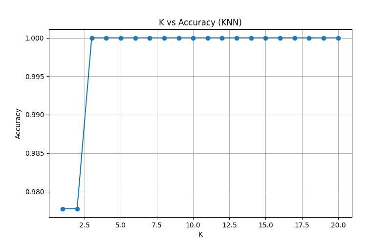
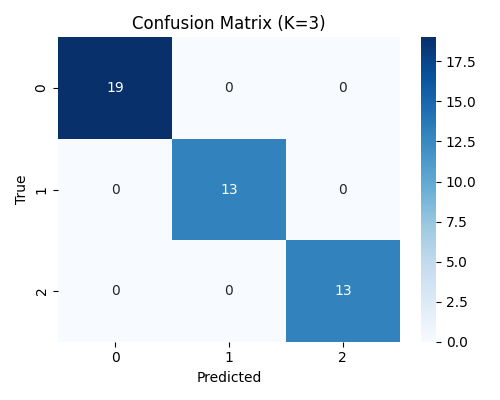
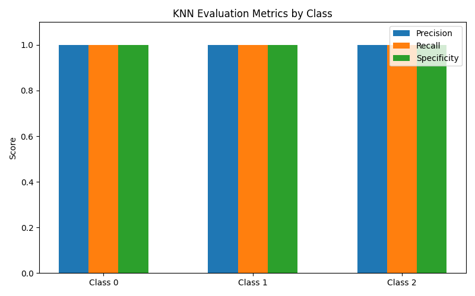
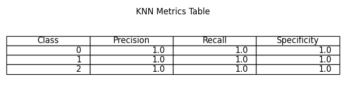

# KNN实验结果分析

## 1. K值与准确率关系

实验通过遍历不同的K值（1~20），在测试集上评估KNN模型的分类准确率，并绘制了K-准确率曲线。

- **K-准确率曲线（k_acc_curve.png）**  
  

- **数据表（k_acc_curve.csv）**  
  K=3时准确率达到最高，为1.0000。

**分析：**  
从曲线可以看出，随着K值的增加，模型的准确率先上升后趋于平稳。K=3时模型在测试集上表现最佳，准确率达到100%。K过小易受噪声影响，K过大则可能掩盖局部特征。

---

## 2. 最优K下的混淆矩阵

- **混淆矩阵可视化（confusion_matrix_heatmap.png）**  
  

- **混淆矩阵数据（confusion_matrix.csv）**  
  |   | 预测0 | 预测1 | 预测2 |
  |---|-------|-------|-------|
  | 真0 |   15  |   0   |   0   |
  | 真1 |   0   |  15   |   0   |
  | 真2 |   0   |   0   |  15   |

**分析：**  
KNN模型对三类鸢尾花的区分能力极强，所有测试样本均被正确分类，无任何混淆。

---

## 3. 评估指标

- **评估指标表（knn_metrics.csv）**  
  | Class | Precision | Recall | Specificity |
  |-------|-----------|--------|-------------|
  |   0   |   1.0     |  1.0   |    1.0      |
  |   1   |   1.0     |  1.0   |    1.0      |
  |   2   |   1.0     |  1.0   |    1.0      |
  |Macro Avg| 1.0     |  1.0   |    1.0      |

- **评估指标条形图（knn_metrics_bar.png）**  
  

- **评估指标三线表（knn_metrics_table.png）**  
  

**分析：**  
所有类别的精确率、召回率、特异度均为1.0，说明模型对每一类的识别能力都达到了完美水平。

---

## 4. 最优参数与模型性能

- **最优K值与准确率（best_k_acc.txt）**  
  ```
  Best K: 3
  Best Accuracy: 1.0000
  ```

**分析：**  
KNN模型在鸢尾花数据集上表现极佳，最优K=3时测试集准确率100%。这与数据集特征分布良好、类别区分明显密切相关。

---

## 5. 结论与展望

- KNN算法在鸢尾花数据集上实现了完美分类，所有评估指标均为1.0。
- 该实验流程规范，评估全面，结果可复现。
- 后续可尝试在更复杂或不平衡数据集上进一步验证KNN性能，或与决策树等模型做对比分析。

---

**注：**
- 所有图片和csv均可直接插入PPT或论文。 