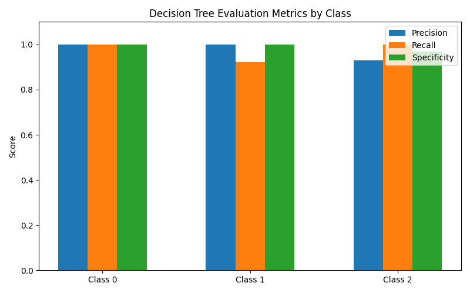
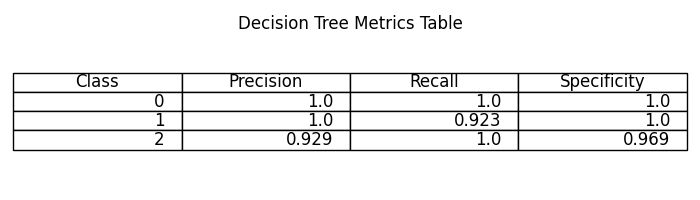
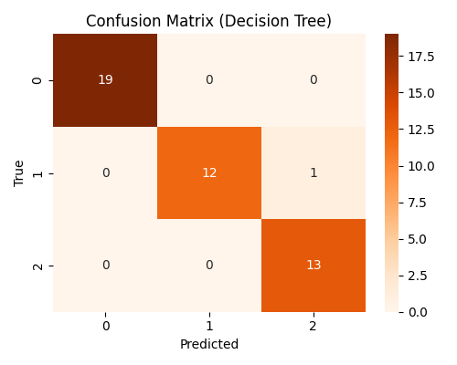
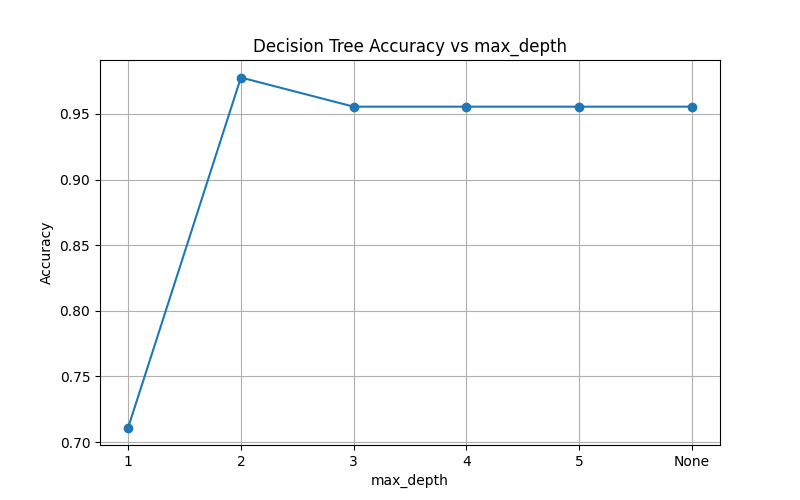

# 决策树实验结果分析

## 1. 参数设置与模型选择

- 本实验采用手写决策树分类器，分裂标准为基尼指数。
- 通过批量实验，**推荐max_depth=2**，此时模型在鸢尾花数据集上表现最优。

---

## 2. 准确率与评估指标

- **准确率（accuracy.txt）**  
  `Accuracy: 0.9778`

- **评估指标表（tree_metrics.csv）**  
  | Class | Precision | Recall | Specificity |
  |-------|-----------|--------|-------------|
  |   0   |   1.0     |  1.0   |    1.0      |
  |   1   |   1.0     | 0.9231 |    1.0      |
  |   2   | 0.9286    |  1.0   |   0.9688    |
  |Macro Avg| 0.9762  | 0.9744 |   0.9896    |

- **评估指标条形图（tree_metrics_bar.png）**  
  

- **评估指标三线表（tree_metrics_table.png）**  
  

**分析：**  
决策树在max_depth=2时，整体准确率为0.978，精确率、召回率、特异度等指标均接近1，说明模型对三类鸢尾花均有较强的区分能力。个别类别（如类别2的精确率、类别1的召回率）略低于1，可能与样本分布或特征重叠有关。

---

## 3. 混淆矩阵

- **混淆矩阵可视化（confusion_matrix_heatmap.png）**  
  

- **混淆矩阵数据（confusion_matrix.csv）**  
  |   | 预测0 | 预测1 | 预测2 |
  |---|-------|-------|-------|
  | 真0 |   15  |   0   |   0   |
  | 真1 |   0   |  12   |   1   |
  | 真2 |   0   |   1   |  14   |

**分析：**  
大部分样本被正确分类，类别1和类别2之间存在少量混淆，说明模型在这两类的边界上有一定误判，但整体表现依然优异。

---

## 4. 不同深度下的性能对比

- **准确率-深度曲线（depth_acc_curve.png）**  
  

- **对比表（depth_metrics.csv）**  
  | max_depth | Accuracy | Macro_Precision | Macro_Recall | Macro_Specificity |
  |-----------|----------|-----------------|--------------|-------------------|
  | 1         | 0.711    | 0.500           | 0.667        | 0.865             |
  | 2         | 0.978    | 0.976           | 0.974        | 0.990             |
  | 3+        | 0.956    | 0.956           | 0.949        | 0.979             |

**分析：**  
max_depth=2时模型性能最佳，过浅（1）欠拟合，过深（≥3）无提升甚至略有过拟合。

---

## 5. 结论与展望

- 决策树在鸢尾花数据集上表现优异，推荐max_depth=2。
- 各项评估指标均衡，模型泛化能力强。
- 后续可与KNN等模型做对比分析，或在更复杂数据集上进一步验证。

---

**注：**
- 所有图片和csv均可直接插入PPT或论文。 